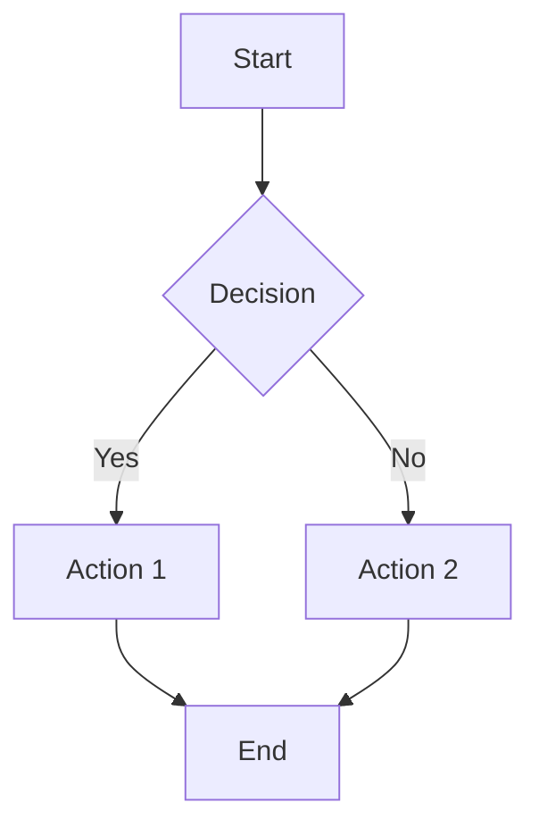
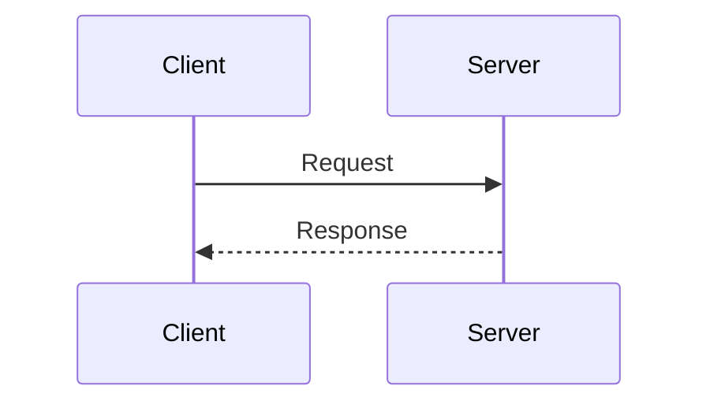
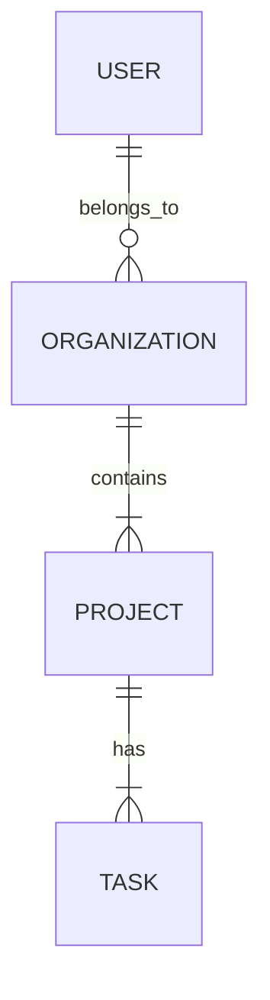
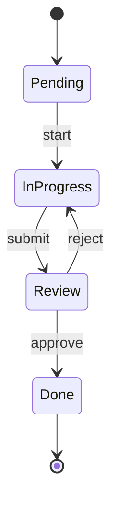

# Repository Documentation Skill

## Purpose

Provide standardized templates for creating version-controlled technical documentation. These templates ensure consistent, high-quality documentation that lives alongside the code in the ConTStack monorepo.

## When This Skill Applies

Invoke this skill when:

- Creating Architecture Decision Records (ADRs)
- Writing operational runbooks
- Documenting incident postmortems
- Creating or updating CLAUDE.md files
- Documenting system architecture with diagrams
- Writing technical specifications
- Creating knowledge transfer (KT) documents

## Documentation Hierarchy

ConTStack uses a hierarchical documentation structure:

```
/
├── CLAUDE.md                          # Master development guide (root)
├── README.md                          # Project overview & quick start
├── docs/
│   ├── CLAUDE.md                      # Documentation organization guide
│   ├── decisions/                     # Architecture Decision Records
│   │   └── XXXX-title.md
│   ├── runbooks/                      # Operational runbooks
│   │   └── feature-name.md
│   ├── postmortems/                   # Incident postmortems
│   │   └── YYYY-MM-DD-incident-title.md
│   └── Research Before Code/          # Pre-implementation research
├── apps/
│   ├── CLAUDE.md                      # Apps router (development patterns)
│   ├── app/CLAUDE.md                  # Main SaaS app guide
│   ├── web/CLAUDE.md                  # Marketing site guide
│   ├── crm/CLAUDE.md                  # CRM app guide
│   └── tasks/CLAUDE.md                # Tasks app guide
├── packages/
│   ├── CLAUDE.md                      # Packages router
│   ├── backend/CLAUDE.md              # Convex backend guide
│   ├── ui/CLAUDE.md                   # Component library guide
│   ├── email/CLAUDE.md                # Email templates guide
│   └── llm/CLAUDE.md                  # LLM integration guide
├── tests/CLAUDE.md                    # Testing patterns guide
├── scripts/CLAUDE.md                  # Automation guide
├── infra/CLAUDE.md                    # Infrastructure guide
└── docker/CLAUDE.md                   # Container development guide
```

## Existing ADRs (Reference)

| ADR  | Location                                   | Topic                        |
| ---- | ------------------------------------------ | ---------------------------- |
| 0001 | `docs/decisions/0001-convex-backend.md`    | Convex as backend            |
| 0002 | `docs/decisions/0002-workos-auth.md`       | WorkOS AuthKit for auth      |
| 0003 | `docs/decisions/0003-monorepo-structure.md`| Turborepo monorepo structure |

> **Note**: Create new ADRs with sequential numbering (0004, 0005, etc.)

## ADR Template (Architecture Decision Record)

**Location**: `docs/decisions/XXXX-title.md`
**Naming**: Use 4-digit sequential number + kebab-case title

```markdown
# ADR-XXXX: [Title]

**Date**: YYYY-MM-DD
**Status**: [Proposed | Accepted | Deprecated | Superseded by ADR-XXXX]
**Author**: [Name or Agent ID]

## Context

What is the issue that we're seeing that motivates this decision?

## Decision

What is the change that we're proposing and/or doing?

## Consequences

### Positive

- [Benefit 1]
- [Benefit 2]

### Negative

- [Tradeoff 1]
- [Tradeoff 2]

### Neutral

- [Observation that neither helps nor hurts]

## Implementation Notes

How should this decision be implemented?

\`\`\`typescript
// Example code if applicable
\`\`\`

## Alternatives Considered

### Alternative 1: [Name]

- **Pros**: [Benefits]
- **Cons**: [Drawbacks]
- **Why rejected**: [Reasoning]

## Related Decisions

- ADR-XXXX: [Related decision]

## References

- [Link to relevant documentation]
- [External resources]
```

## Runbook Template

**Location**: `docs/runbooks/feature-name.md`
**Naming**: Use kebab-case descriptive name

```markdown
# Runbook: [Operation Name]

**Last Updated**: YYYY-MM-DD
**Owner**: [Team/Role]
**Severity**: [P0-Critical | P1-High | P2-Medium | P3-Low]

## Overview

Brief description of what this runbook covers and when to use it.

## Prerequisites

- [ ] Access to [system/service]
- [ ] Required permissions: [list permissions]
- [ ] Tools installed: [list tools]
- [ ] Environment variables set: [list env vars]

## Procedure

### Step 1: [Action Name]

**Purpose**: Why this step is needed

\`\`\`bash
# Command to execute
bun run [command]
\`\`\`

**Expected output**:
\`\`\`
Expected output here
\`\`\`

**If error**: What to do if something goes wrong

### Step 2: [Action Name]

...

## Verification

How to verify the operation was successful:

\`\`\`bash
# Verification command
curl http://localhost:3000/health
\`\`\`

**Expected result**: [Description of success state]

## Rollback

Steps to undo the operation if needed:

\`\`\`bash
# Rollback commands
git revert [commit]
\`\`\`

## Troubleshooting

### Issue: [Common problem]

**Symptoms**: What you see
**Cause**: Why it happens
**Solution**:

\`\`\`bash
# Fix command
\`\`\`

### Issue: [Another common problem]

...

## Contacts

- **Primary**: [Name/Role] - [contact method]
- **Escalation**: [Name/Role] - [contact method]

## Related Documentation

- [Link to related runbook]
- [Link to CLAUDE.md section]
- [Link to external docs]

## Revision History

| Date       | Author | Changes         |
| ---------- | ------ | --------------- |
| YYYY-MM-DD | Name   | Initial version |
```

## Postmortem Template

**Location**: `docs/postmortems/YYYY-MM-DD-incident-title.md`
**Naming**: Use date prefix + kebab-case incident description

```markdown
# Postmortem: [Incident Title]

**Date**: YYYY-MM-DD
**Duration**: [X hours/minutes]
**Severity**: [P0-Critical | P1-High | P2-Medium | P3-Low]
**Status**: [RESOLVED | ONGOING | MONITORING]

---

## TL;DR for Future Agents

[2-3 sentence summary of what happened and the key fix. This helps future agents quickly understand without reading the full document.]

**Key Rule**: [One-liner prevention rule that should be followed]

---

## Timeline

| Time (UTC) | Event                          |
| ---------- | ------------------------------ |
| HH:MM      | [First symptom observed]       |
| HH:MM      | [Investigation started]        |
| HH:MM      | [Root cause identified]        |
| HH:MM      | [Fix deployed]                 |
| HH:MM      | [Verification complete]        |

## Symptoms

What was observed that indicated a problem:

\`\`\`
Error message or log output
\`\`\`

## Root Cause

Detailed explanation of what caused the issue:

1. **Primary Cause**: [Main reason]
2. **Contributing Factors**: [Secondary reasons]

### Technical Details

\`\`\`typescript
// Code that caused the issue
// Explanation of why it failed
\`\`\`

## Solution Applied

### Immediate Fix

\`\`\`bash
# Commands or code changes that fixed the issue
\`\`\`

### Permanent Fix

What changes were made to prevent recurrence:

| File | Change | Rationale |
| ---- | ------ | --------- |
| `path/to/file.ts` | [Description] | [Why] |

## Prevention Rules

### Rule 1: [Category]

\`\`\`typescript
// Template for correct pattern
// vs incorrect pattern
\`\`\`

### Rule 2: [Category]

...

## Debugging Process

### What Worked

\`\`\`bash
# Commands that helped diagnose the issue
\`\`\`

### What Didn't Work

- [Attempted solution 1] - Why it failed
- [Attempted solution 2] - Why it failed

## Verification Checklist

After applying fixes, verify:

- [ ] [Check 1]
- [ ] [Check 2]
- [ ] [Check 3]

## Action Items

| Priority | Action | Owner | Status |
| -------- | ------ | ----- | ------ |
| P1 | [Action item] | [Name] | [ ] |
| P2 | [Action item] | [Name] | [ ] |

## Related Documentation

- [Link to relevant CLAUDE.md section]
- [Link to related postmortem]
- [External documentation]
```

## CLAUDE.md Template

**Location**: `[package-or-app]/CLAUDE.md`
**Purpose**: Quick-reference guide for development agents working on specific package/app

```markdown
# [Package/App Name] Development Guide

> Quick-reference guide for development on [package/app name]

## Overview

[1-2 sentences describing what this package/app does]

## Quick Commands

\`\`\`bash
# Development
bun dev:[app-name]       # Start development server

# Testing
bun test                 # Run tests
bun test:watch           # Run tests in watch mode

# Building
bun build               # Production build
\`\`\`

## Directory Structure

\`\`\`
src/
├── components/          # React components
│   ├── ui/             # Base UI components
│   └── features/       # Feature-specific components
├── hooks/              # Custom React hooks
├── lib/                # Utility functions
└── app/                # Next.js App Router pages
\`\`\`

## Key Patterns

### Pattern 1: [Name]

\`\`\`typescript
// Example code demonstrating the pattern
\`\`\`

### Pattern 2: [Name]

\`\`\`typescript
// Example code
\`\`\`

## Common Tasks

### Task 1: [Description]

1. Step 1
2. Step 2
3. Step 3

### Task 2: [Description]

...

## Integration Points

- **[Package/Service]**: How this integrates with [X]
- **[Package/Service]**: How this integrates with [Y]

## Troubleshooting

### Issue: [Common problem]

**Solution**: [Fix]

## Cross-References

- [Root CLAUDE.md](/CLAUDE.md) - Master development guide
- [Related Package CLAUDE.md](/packages/[name]/CLAUDE.md) - Related patterns
```

## Architecture Document Template

**Location**: `docs/architecture/[system-name].md`
**Naming**: Use kebab-case system name

```markdown
# [System/Component] Architecture

**Last Updated**: YYYY-MM-DD
**Author**: [Name or Agent ID]

## Overview

High-level description of the system/component and its role in ConTStack.

## Goals and Non-Goals

### Goals

- [What this system should do]
- [Primary objectives]

### Non-Goals

- [What this system should NOT do]
- [Explicit exclusions]

## Architecture Diagram

\`\`\`mermaid
graph TD
    A[Client] --> B[Next.js App]
    B --> C[Middleware]
    C --> D{Auth Check}
    D -->|Authenticated| E[Convex Backend]
    D -->|Unauthenticated| F[Login]
    E --> G[(Database)]
    E --> H[External APIs]
\`\`\`

## Components

### Component 1: [Name]

- **Purpose**: What it does
- **Location**: `path/to/component`
- **Dependencies**: What it needs
- **Consumers**: What uses it

### Component 2: [Name]

...

## Data Flow

\`\`\`mermaid
sequenceDiagram
    participant C as Client
    participant N as Next.js
    participant X as Convex
    participant D as Database

    C->>N: Request
    N->>X: Query/Mutation
    X->>D: Database operation
    D-->>X: Result
    X-->>N: Response
    N-->>C: Rendered page
\`\`\`

## Security Considerations

### Authentication

- [Auth mechanism used]
- [Token handling]

### Authorization (RBAC)

- [Permission model]
- [Role hierarchy]

### Data Protection

- [Encryption at rest]
- [Encryption in transit]
- [Multi-tenant isolation]

## Performance Considerations

### Caching Strategy

- [Where caching is applied]
- [Cache invalidation approach]

### Database Optimization

- [Indexes used]
- [Query optimization patterns]

### API Response Times

- [Target latencies]
- [Monitoring approach]

## Monitoring and Observability

### Key Metrics

| Metric | Target | Alert Threshold |
| ------ | ------ | --------------- |
| [Metric 1] | [Value] | [Threshold] |

### Log Locations

- **Application logs**: [Location]
- **Error tracking**: [Service]

### Alerting

- [Alert configuration]

## Future Considerations

- [Planned improvements]
- [Technical debt to address]
- [Scalability considerations]

## References

- Related ADRs: [ADR-XXXX]
- External documentation: [Links]
```

## Knowledge Transfer (KT) Document Template

**Location**: `docs/knowledge-transfer/[topic].md`
**Naming**: Use kebab-case topic name

```markdown
# KT: [Topic Name]

**Date**: YYYY-MM-DD
**Author**: [Name or Agent ID]
**Related Issues**: [Beads/Linear issue IDs]

## Summary

What was done and why it matters. [2-3 sentences]

## Context

Background information needed to understand this work:

- [Context point 1]
- [Context point 2]

## Key Decisions Made

1. **[Decision 1]**: [Reasoning]
2. **[Decision 2]**: [Reasoning]

## Implementation Details

### What Changed

| File | Change | Purpose |
| ---- | ------ | ------- |
| `path/to/file.ts` | [Description] | [Why] |

### How It Works

[Explanation of the implementation]

\`\`\`typescript
// Key code example with comments
\`\`\`

## Gotchas and Lessons Learned

Things that might trip up future developers:

1. **[Gotcha 1]**: [Explanation and how to avoid]
2. **[Gotcha 2]**: [Explanation and how to avoid]

## Testing

How to verify everything works:

\`\`\`bash
# Test commands
bun test path/to/test
\`\`\`

## Related Work

- [Link to related issue]
- [Link to related documentation]

## Future Work

What should be done next:

- [ ] [Follow-up task 1]
- [ ] [Follow-up task 2]
```

## Documentation Output Locations

| Doc Type       | Location                       | Naming Convention                  |
| -------------- | ------------------------------ | ---------------------------------- |
| ADRs           | `docs/decisions/`              | `XXXX-description.md`              |
| Runbooks       | `docs/runbooks/`               | `feature-name.md`                  |
| Postmortems    | `docs/postmortems/`            | `YYYY-MM-DD-incident-title.md`     |
| Architecture   | `docs/architecture/`           | `system-name.md`                   |
| KT Docs        | `docs/knowledge-transfer/`     | `topic-name.md`                    |
| Package Guides | `packages/[name]/CLAUDE.md`    | `CLAUDE.md` (exact name)           |
| App Guides     | `apps/[name]/CLAUDE.md`        | `CLAUDE.md` (exact name)           |
| Research       | `docs/Research Before Code/`   | `topic-name.md` or numbered        |

## Mermaid Diagram Types

Use Mermaid for all diagrams (renders in GitHub and most markdown viewers):

### Flowcharts (Architecture)



### Sequence Diagrams (Data Flow)



### Entity Relationship (Database)



### State Diagrams (Workflows)



## Documentation Checklist

Before committing any documentation:

- [ ] Clear, descriptive title
- [ ] Proper heading hierarchy (H1 > H2 > H3)
- [ ] Code blocks with language tags
- [ ] Links to related documents use relative paths
- [ ] Date and author included
- [ ] No sensitive data (secrets, passwords, tokens)
- [ ] Spell-checked
- [ ] Mermaid diagrams render correctly
- [ ] Cross-references to CLAUDE.md files where relevant
- [ ] File follows naming convention for its type

## Git Commit Convention for Docs

```bash
# ADRs
git commit -m "docs(adr): add ADR-0004 for caching strategy"

# Runbooks
git commit -m "docs(runbook): add deployment rollback procedure"

# Postmortems
git commit -m "docs(postmortem): add 2025-01-12 auth outage analysis"

# CLAUDE.md updates
git commit -m "docs(claude): update backend patterns for new auth flow"

# Architecture docs
git commit -m "docs(arch): add BubbleLab execution engine diagram"
```

## Quality Standards

### Documentation Must

- Be version-controlled with related code changes
- Use relative links for internal references
- Include working code examples
- Be updated when referenced code changes
- Follow the templates in this skill

### Documentation Should

- Include diagrams for complex flows
- Reference relevant CLAUDE.md sections
- Provide troubleshooting guidance
- Include verification steps
- Link to related external documentation

### Documentation Must Not

- Contain hardcoded secrets or tokens
- Include absolute paths that vary by environment
- Have broken internal links
- Duplicate content from other docs (link instead)
- Be created without following the appropriate template
