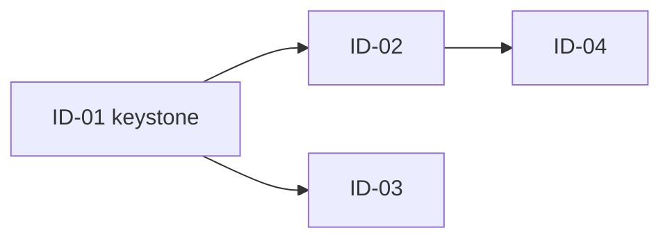

# Program: [Program Name]

> Scaffolding for a **SAFe x AI-DLC program** -- an initiative decomposed into Units of Work and
> sequenced into Bolts. Replace every bracketed placeholder. Delete guidance blockquotes before
> committing. Method reference: [SAFe x AI-DLC Methodology](../docs/guides/SAFE-AI-DLC-METHODOLOGY.md).

| Field            | Value                                    |
| ---------------- | ---------------------------------------- |
| Initiative       | [{{TICKET_PREFIX}}-XXX / initiative URL] |
| Source           | [audit, epic, or incident that triggered this] |
| Method           | SAFe x AI-DLC                            |
| Owner (HITL)     | [role or name]                           |
| Date             | [YYYY-MM-DD]                             |
| Status           | [Proposed / Active / Complete]           |

---

## Why This Exists

> One or two paragraphs. State the problem in terms a reader outside the team would understand, and
> name the single finding that justifies the whole program. Be concrete -- "a green CI run currently
> means nothing" beats "quality needs improvement."

[Problem statement.]

**Program outcome**: [The one sentence that describes done.]

---

## Units of Work

> Each project is one coherent outcome, not a grab-bag. Lead role must be an existing `agent:*` label.

| Project | Outcome | Issues | Bolt | Lead role |
| ------- | ------- | ------ | ---- | --------- |
| P1 [Name] | [What is true when this is done] | [IDs] | `bolt:N` | `agent:*` |
| P2 [Name] | | | | |
| P3 [Name] | | | | |

**Streams**: [If the tracker plan supports sub-initiatives, name them. Otherwise state how project
priority encodes the streams -- e.g. Urgent/High = highest-risk stream, Medium = follow-up.]

---

## Issues

> One row per issue. WSJF drives ordering within a Bolt; MoSCoW records negotiability.

| ID | Ticket | Title | Project | Bolt | Phase | WSJF | MoSCoW | Status |
| -- | ------ | ----- | ------- | ---- | ----- | ---- | ------ | ------ |
| [ID] | {{TICKET_PREFIX}}-XXX | | | `bolt:N` | Inception | | Must | |

---

## Bolt Timeline

> A Bolt exits on **evidence**, not on a date. Entry and exit criteria are mandatory -- a Bolt with
> vague exit criteria will not close cleanly.

| Bolt | Name | Duration | Issues (in order) | Entry criteria | Exit criteria |
| ---- | ---- | -------- | ----------------- | -------------- | ------------- |
| 0 | [Containment] | Hours | | [What must be true to start] | [What proves it is done] |
| 1 | [Name] | 2-3 days | | Bolt 0 complete | |
| 2 | [Name] | 2-3 days | | | |

### The Mob Model

A Bolt is a short swarm, not a solo assignment. The lead role opens each issue, runs Mob Elaboration
into sub-issues, and **pauses for the human to validate business context** before Mob Construction
begins. A Bolt exits only when its issues are **merged to `{{MAIN_BRANCH}}`**, the **relevant gates
are real and green**, and **evidence is posted to the tracker**. A green check that still masks a
failure is not an exit.

---

## Dependency DAG

> Wire so the enforcement lands before the thing it enforces: fix the gate before the fix it
> verifies; rotate before scrub; capture before alert; upgrades before re-baseline.

**Critical path**: [Name the keystone issue and explain why it gates the rest.]

**Soft links** (`relatedTo`, not blocking): [list]

---

## AI-DLC Phase Index

> Which issues need real elaboration before anyone writes code, and which are ready to build.

- **Inception-heavy** (unknowns to resolve, decisions to route): [IDs]
- **Construction-ready** (elaborated, unblocked): [IDs]
- **Operations** (deploy, schedule, run): [IDs]

> An issue may appear in two phases -- e.g. a policy decision in Inception and the scheduled job that
> enforces it in Operations. Note those explicitly.

---

## Roles and RACI

| Concern                     | Responsible  | Accountable | Consulted   | Informed |
| --------------------------- | ------------ | ----------- | ----------- | -------- |
| [Unit of Work]              | `agent:*`    | `agent:rte` | [role]      | Team     |
| Business-context decisions  | HITL         | HITL        | Lead role   | Team     |
| Final merge (HITL)          | HITL         | HITL        | `agent:rte` | Team     |

**Agents lead the build; the human owns the judgment.**

---

## Definition of Done

Every issue in this program is done only when all four hold:

- Code is **merged to `{{MAIN_BRANCH}}`** via rebase-and-merge with a
  `type(scope): description [{{TICKET_PREFIX}}-XXX]` commit.
- The **relevant gate is now real and green** -- it enforces the thing it claims, with no masking.
- **Evidence is posted to the tracker** (dev/staging/done as applicable).
- **No silent suppressions** were added: no new error-swallowing, no broadened ignore globs, no
  non-blocking downgrade of a check that should block.

---

## Human Gates

> Decisions the agents must never make alone. Surface options with a recommendation, then stop.

- [ ] Approve the program structure and naming
- [ ] [Any credential rotation or production action -- owned by the human]
- [ ] Set Bolt target dates
- [ ] [Fix-versus-suppress budget, if applicable]
- [ ] [Security policy decisions: CSP allow-list, auth behavior, headers]
- [ ] [Which CI checks become required]
- [ ] [Dependency severity policy]
- [ ] [Any SOP exception]
- [ ] Sign the Definition of Done and accept each Bolt's evidence

---

## Change Log

| Date | Change | Author |
| ---- | ------ | ------ |
| [YYYY-MM-DD] | Program created | [role] |
